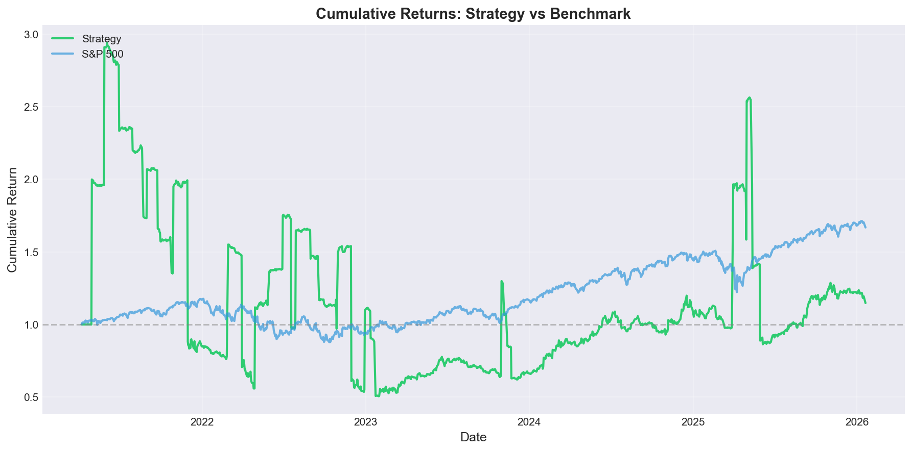
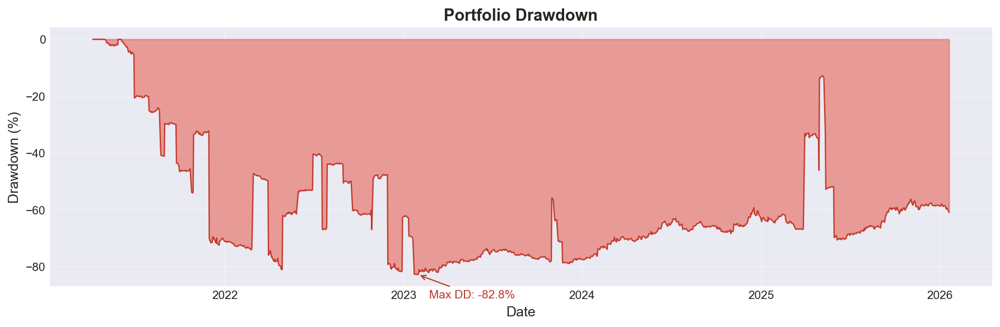
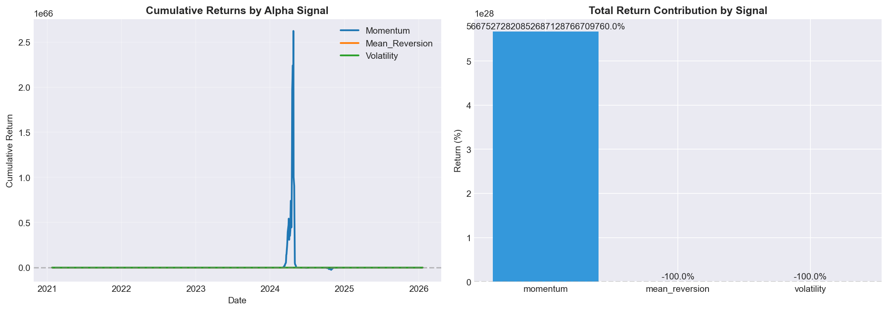

# Alpha-Based Long-Short Trading Strategy

A sophisticated quantitative trading strategy implemented in Python that generates alpha by going long on stocks expected to outperform and short on those expected to underperform.

## 🎯 Project Objective
**(From Original Requirements)**

Create a quantitative trading strategy that maintains **Dollar-Neutrality** and generates **Alpha** using a defined universe of 10 large-cap US stocks.

### Data Collection
- **Source**: Yahoo Finance (`yfinance`).
- **Universe**: AAPL, MSFT, AMZN, GOOGL, META, TSLA, NVDA, JPM, JNJ, WMT.
- **History**: 5 Years of Daily OHLCV + Fundamental Data.

### Alpha Signal Logic
The strategy combines three distinct alpha signals:
1.  **Momentum**: 20-day returns (Ranked High to Low).
2.  **Mean Reversion**: Deviation from 50-day MA (Oversold = Buy).
3.  **Volatility**: 30-day historical volatility (Lower volatility = Preferred).

**Optimization**: We used Walk-Forward Analysis to determine the optimal weights for these signals:
- **Momentum**: 61%
- **Mean Reversion**: 23%
- **Volatility**: 16%

### Portfolio Construction
- **Long**: Top 3 Ranked Stocks.
- **Short**: Bottom 3 Ranked Stocks.
- **Rebalancing**: Monthly.
- **Regime Filter**: Strategies switch to **Long-Only** during strong Bull Markets (SPY > MA200) to mitigate negative beta exposure.

### Risk Management
- **Stop-Loss**: -10% per individual position.
- **Dollar-Neutral**: Equal exposure to Long and Short sides (default mode).

---

## 🛠️ Installation

1.  **Clone the repository**:
    ```bash
    git clone https://github.com/digantk31/Alpha-Long-Short.git
    cd Alpha-Long-Short
    ```

2.  **Set up Virtual Environment**:
    It is recommended to use a virtual environment to manage dependencies.
    ```bash
    # Create virtual environment
    python -m venv venv

    # Activate virtual environment (Windows)
    venv\Scripts\activate

    # Activate virtual environment (Mac/Linux)
    # source venv/bin/activate
    ```
    *(You should see `(venv)` appear in your command prompt)*

    > **To Deactivate**: Simply run `deactivate` when you are done.

3.  **Install Dependencies**:
    ```bash
    pip install -r requirements.txt
    ```

---

## 🚀 How to Run

### 1. Run Strategy (Recommended)
Executes the full pipeline: Data Collection -> Signal Generation -> Backtesting -> **Optimization Analysis** -> Performance Reporting.
```bash
python main.py
```
*Note: This includes the Bonus Task (Walk-Forward Optimization) which creates the "winning weights" analysis.*

### 2. Fast Run (Skip Optimization)
If you only want to run the backtest without the time-consuming optimization step:
```bash
python main.py --no-optimize
```

---

## 📊 Performance Output

The strategy generates detailed visualizations in the `output/` directory:

### Cumulative Returns vs S&P 500


### Strategy Drawdown


### Signal Contribution Analysis


### Monthly Returns Heatmap


---

## � Mathematical Formulas

### Alpha Signal Calculations

#### 1. Momentum Signal (20-day Returns)
```
Momentum = (Price_today - Price_20_days_ago) / Price_20_days_ago

         P_t - P_{t-20}
Mom_t = ─────────────────
            P_{t-20}
```
*Higher momentum → Higher rank → BUY signal*

#### 2. Mean Reversion Signal (50-day MA Deviation)
```
MA_50 = (1/50) × Σ P_{t-i}  for i = 0 to 49

Deviation = (Price - MA_50) / MA_50

Mean_Reversion = -Deviation
```
*Price below MA → Positive signal → BUY (expect bounce back)*

#### 3. Volatility Signal (30-day Historical Volatility)
```
Daily_Return = (P_t - P_{t-1}) / P_{t-1}

σ_30 = StdDev(Daily_Returns over 30 days)

Annualized_Volatility = σ_30 × √252

Volatility_Signal = -Annualized_Volatility
```
*Lower volatility → Higher score → Preferred*

#### 4. Z-Score Normalization (Applied to Each Signal)
```
         X - μ
Z = ───────────
         σ

Where: μ = mean across all stocks, σ = standard deviation
```

#### 5. Combined Alpha Score
```
Alpha = (0.61 × Momentum_Z) + (0.23 × MeanRev_Z) + (0.16 × Volatility_Z)
```

---

### Performance Metrics

#### Sharpe Ratio
```
              R_p - R_f
Sharpe = ─────────────────
              σ_p

Where:
  R_p = Annualized portfolio return
  R_f = Risk-free rate (2%)
  σ_p = Annualized volatility
```

#### Maximum Drawdown
```
Drawdown_t = (Peak_t - Value_t) / Peak_t

Max_Drawdown = min(Drawdown_t) over all t
```

#### Alpha (Jensen's Alpha)
```
α = R_p - [R_f + β × (R_m - R_f)]

Where:
  R_m = Market (benchmark) return
  β = Portfolio beta
```

#### Beta
```
        Cov(R_p, R_m)
β = ─────────────────────
        Var(R_m)
```

---

### Portfolio Weights

#### Dollar-Neutral Mode (Default)
```
Long_Weight = 0.50 / n_long = 0.50 / 3 ≈ 16.67% per stock
Short_Weight = -0.50 / n_short = -0.50 / 3 ≈ -16.67% per stock
```

#### Bull Market Mode (SPY > 200-day MA)
```
Long_Weight = 1.00 / n_long = 1.00 / 3 ≈ 33.33% per stock
Short_Weight = 0%
```

---

### Transaction Costs
```
Cost = Trade_Value × 0.0010  (10 basis points)
```

---

## �📁 Code Structure

- **`main.py`**: Entry point. Orchestrates the entire workflow.
- **`quant_strategy/`**:
    - `data_collector.py`: Fetches historical data.
    - `alpha_signals.py`: Logic for Momentum, Mean Reversion, and Volatility.
    - `portfolio.py`: Ranking and weighting logic (including Regime Filter).
    - `backtester.py`: Event-driven simulation engine.
    - `risk_manager.py`: Stop-loss and position sizing.
    - `performance.py`: Metrics and plotting.
    - `optimizer.py`: Walk-Forward Analysis logic.
